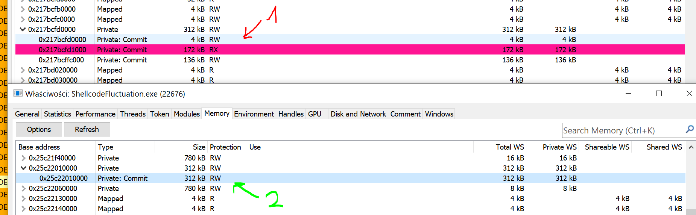
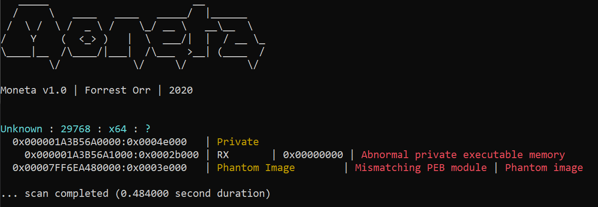
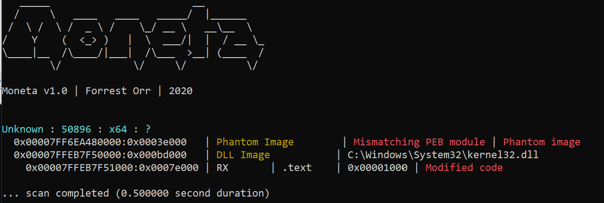
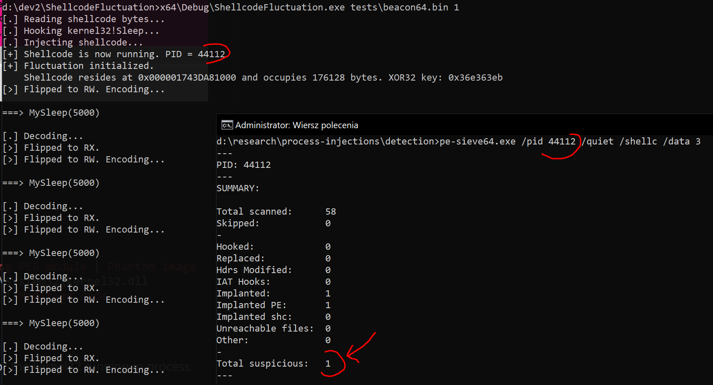
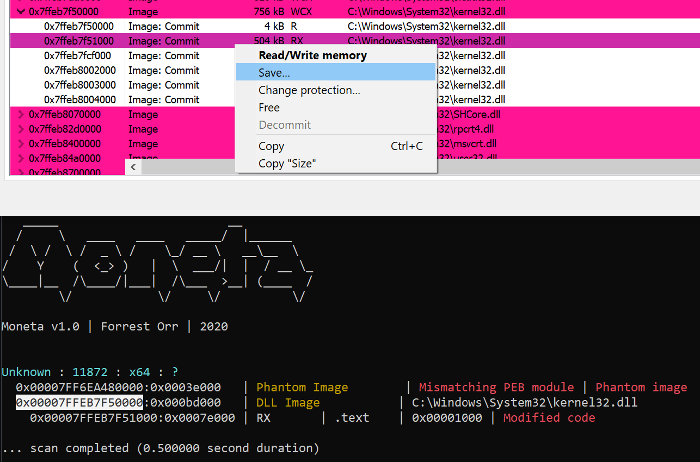
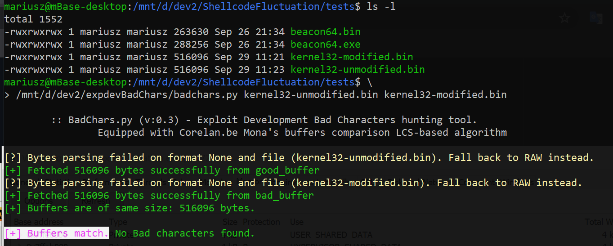
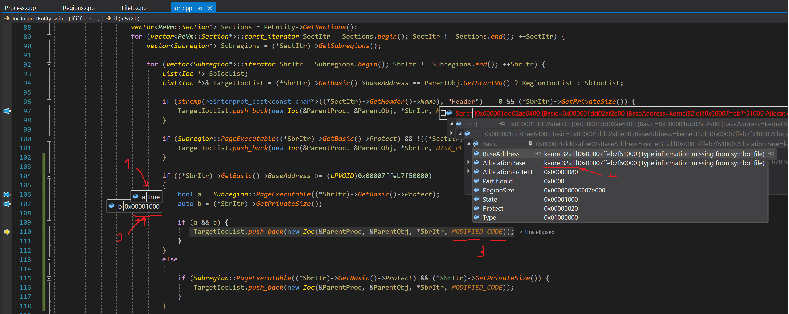

# Shellcode Fluctuation PoC

A PoC implementation for an another in-memory evasion technique that cyclically encrypts and decrypts shellcode's contents to then make it fluctuate between `RW` and `RX` memory protection.
When our shellcode resides in `RW` memory pages, scanners such as [`Moneta`](https://github.com/forrest-orr/moneta) or [`pe-sieve`](https://github.com/hasherezade/pe-sieve) will be unable to track it down and dump it for further analysis.

## Intro

After releasing [ThreadStackSpoofer](https://github.com/mgeeky/ThreadStackSpoofer) I've received a few questions about the following README's point:

> Change your Beacon's memory pages protection to RW (from RX/RWX) and encrypt their contents before sleeping (that could evade scanners such as Moneta or pe-sieve)

Beforewards I was pretty sure the community already know how to encrypt/decrypt their payloads and flip their memory protections to simply evade memory scanners looking for anomalous executable regions.
Questions proven otherwise so I decided to release this unweaponized PoC to document yet another evasion strategy and offer sample implementation for the community to work with.

This PoC is a demonstration of rather simple technique, already known to the offensive community (so I'm not bringin anything new here really) in hope to disclose secrecy behind magic showed by some commercial frameworks that demonstrate their evasion capabilities targeting both aforementioned memory scanners.


**Here's a comparison when fluctuating to RW** (another option is to fluctuate to `PAGE_NOACCESS` - described below):

1. Beacon not encrypted
2. **Beacon encrypted** (_fluctuating_)




This implementation along with my [ThreadStackSpoofer](https://github.com/mgeeky/ThreadStackSpoofer) brings Offensive Security community sample implementations to catch up on the offering made by commercial C2 products, so that we can do no worse in our Red Team toolings. 💪


### It's not a novel technique

The technique is not brand new, nothing that I've devised myself. Merely an implementation showing the concept and its practical utilisation to let our Offensive Security community catch up on offering made by commercial C2 frameworks. 

Actually, I've been introduced to the idea of flipping shellcode's memory protection couple of years back through the work of [**Josh Lospinoso**](https://github.com/JLospinoso) in his amazing [Gargoyle](https://github.com/JLospinoso/gargoyle).

Here's more background:
- [gargoyle, a memory scanning evasion technique](https://lospi.net/security/assembly/c/cpp/developing/software/2017/03/04/gargoyle-memory-analysis-evasion.html)
- [Bypassing Memory Scanners with Cobalt Strike and Gargoyle](https://labs.f-secure.com/blog/experimenting-bypassing-memory-scanners-with-cobalt-strike-and-gargoyle/)

**Gargoyle** takes the concept of self-aware and self-fluctuating shellcode a way further, by leveraging ROP sequence calling out to `VirtualProtect`. 
However the technique is impressive, its equally hard to leverage it with Cobalt Strike's Beacon without having to kill its thread and keep re-initializing Beacon while in memory.

That's far from perfect, however since we already operate from the grounds of our own self-injection loader process, we're able to do whatever we want with the environment in which shellcode operate and hide it however we like. This technique (and the previous one being [ThreadStackSpoofer](https://github.com/mgeeky/ThreadStackSpoofer)) shows advantages from running our shellcodes this way.

The implementation of fluctuating to `PAGE_NOACCESS` is inspired by [ORCA666](https://github.com/ORCA666)'s work presented in his https://github.com/ORCA666/0x41 injector.
ORCA showed that:

1. we can initialize a vectored exception handler (VEH), 
2. flip shellcode's pages to no-access
3. and then catch Access Violation exceptions that will occur as soon as the shellcode wants to resume its execution and decrypt + flip its memory pages back to Read+Execute.

This implementation contains this idea implemented, available with option `2` in `<fluctuate>`.


## How it works?

This program performs self-injection shellcode (roughly via classic `VirtualAlloc` + `memcpy` + `CreateThread`). 
When shellcode runs (this implementation specifically targets Cobalt Strike Beacon implants) a Windows function will be hooked intercepting moment when Beacon falls asleep `kernel32!Sleep`. 
Whenever hooked `MySleep` function gets invoked, it will localise its memory allocation boundaries, flip their protection to `RW` and `xor32` all the bytes stored there. 
Having awaited for expected amount of time, when shellcode gets back to our `MySleep` handler, we'll decrypt shellcode's data and flip protection back to `RX`.

Fluctuation to `PAGE_READWRITE` works as follows:

1. Read shellcode's contents from file.
2. Hook `kernel32!Sleep` pointing back to our callback.
3. Inject and launch shellcode via `VirtualAlloc` + `memcpy` + `CreateThread`. In contrary to what we had in `ThreadStackSpoofer`, here we're not hooking anything in ntdll to launch our shellcode but rather jump to it from our own function. This attempts to avoid leaving simple IOCs in memory pointing at modified ntdll memory.
3. As soon as Beacon attempts to sleep, our `MySleep` callback gets invoked.
4. Beacon's memory allocation gets encrypted and protection flipped to `RW`
5. We then unhook original `kernel32!Sleep` to avoid leaving simple IOC in memory pointing that `Sleep` have been trampolined (in-line hooked).
5. A call to original `::Sleep` is made to let the Beacon's sleep while waiting for further communication.
11. After Sleep is finished, we decrypt our shellcode's data, flip it memory protections back to `RX` and then re-hook `kernel32!Sleep` to ensure interception of subsequent sleep.

Fluctuation to `PAGE_NOACCESS` works as follows (do note that the idea was borrowed from _ORCA666_'s [0x41](https://github.com/ORCA666/0x41) project):

1. Read shellcode's contents from file.
2. Hook `kernel32!Sleep` pointing back to our callback.
3. Inject and launch shellcode via `VirtualAlloc` + `memcpy` + `CreateThread` ...
4. Initialize Vectored Exception Handler (VEH) to setup our own handler that will catch _Access Violation_ exceptions.
5. As soon as Beacon attempts to sleep, our `MySleep` callback gets invoked.
6. Beacon's memory allocation gets encrypted and protection flipped to `PAGE_NOACCESS`
7. We then unhook original `kernel32!Sleep` to avoid leaving simple IOC in memory pointing that `Sleep` have been trampolined (in-line hooked).
8. A call to original `::Sleep` is made to let the Beacon's sleep while waiting for further communication.
9. After Sleep is finished, we re-hook `kernel32!Sleep` to ensure interception of subsequent sleep.
10. Shellcode then attempts to resume its execution which results in Access Violation being throwed since its pages are marked NoAccess.
11. Our VEH Handler catches the exception, decrypts and flips memory protections back to `RX` and shellcode's is resumed.


## Demo

The tool `ShellcodeFluctuation` accepts three parameters: first one being path to the shellcode and the second one modifier of our functionality.

```
Usage: ShellcodeFluctuation.exe <shellcode> <fluctuate>
<fluctuate>:
        -1 - Read shellcode but dont inject it. Run in an infinite loop.
        0 - Inject the shellcode but don't hook kernel32!Sleep and don't encrypt anything
        1 - Inject shellcode and start fluctuating its memory with standard PAGE_READWRITE.
        2 - Inject shellcode and start fluctuating its memory with ORCA666's PAGE_NOACCESS.
```

### Moneta (seemingly) False Positive

```
C:\> ShellcodeFluctuation.exe beacon64.bin -1
```

So firstly we'll see what `Moneta64` scanner thinks about process that does nothing dodgy and simply resorts to run an infinite loop:


As we can see there's some **false positive** (at least how I consider it) allegdly detecting `Mismatching PEB module` / `Phantom image`. 
The memory boundaries point at the `ShellcodeFluctuate.exe` module itself and could indicate that this module however being of `MEM_IMAGE` type, is not linked in process' PEB - which is unsual and sounds rather odd.
The reason for this IOC is not known to me and I didn't attempt to understand it better, yet it isn't something we should be concerned about really.

If anyone knows what's the reason for this detection, I'd be very curious to hear! Please do reach out.

### Not Encrypted Beacon

```
C:\> ShellcodeFluctuation.exe beacon64.bin 0
```

The second use case presents Memory IOCs of a Beacon operating within our process, which does not utilise any sorts of customised `Artifact Kits`, `User-Defined Reflective Loaders` (such as my [`ElusiveMice`](https://github.com/mgeeky/ElusiveMice)), neither any initial actions that would spoil our results. 



We can see that `Moneta64` correctly recognizes `Abnormal private executable memory` pointing at the location where our shellcode resides. 
That's really strong Memory IOC exposing our shellcode for getting dumped and analysed by automated scanners. Not cool.

### Encrypted Beacon with RW protections

```
C:\> ShellcodeFluctuation.exe beacon64.bin 1
```

Now the third, most interesting from perspective of this implementation, use case being _fluctuating_ Beacon.



Apart from the first IOC, considered somewhat _false positive_, we see a new one pointing that `kernel32.dll` memory was modified. 
However, no `Abnormal private executable memory` IOC this time. Our fluctuation (repeated encryption/decryption and memory protections flipping is active).

And for the record, `pe-sieve` also detects implanted PE when used with `/data 3` option (unless this option is given, no detection will be made):



My current assumption is that PE-Sieve is picking up on the same traits that Moneta does (described below in _Modified code in kernel32.dll_) - the fact that PE mapped module has a non-empty Working set, being an evident fact of code injection of some sort.
That is labeled as _Implanted PE_ / _Implanted_. If that's the case, conclusion is similar to the Moneta's observation. I don't think we should care that much about that IOC detection-wise.

Currently I thought of no better option to intercept shellcode's execution in the middle (now speaking of Cobalt Strike), other than to hook `kernel32!Sleep`. Thus, we are bound to leave these sorts of IOCs.

But hey, still none of the bytes differ compared to what is lying out there on the filesystem (`C:\Windows\System32\kernel32.dll`) and no function is hooked, what's the deal? 😉


### Encrypted Beacon with PAGE_NOACCESS protections

```
C:\> ShellcodeFluctuation.exe beacon64.bin 2
```

That will cause the shellcode to fluctuate between `RX` and `NA` pages effectively:

```
C:\> ShellcodeFluctuation.exe beacon64.bin 2
[.] Reading shellcode bytes...
[.] Hooking kernel32!Sleep...

[.] Initializing VEH Handler to intercept invalid memory accesses due to PAGE_NOACCESS.
    This is a re-implementation of ORCA666's work presented in his https://github.com/ORCA666/0x41 project.

[.] Injecting shellcode...
[+] Shellcode is now running. PID = 45312
[+] Fluctuation initialized.
    Shellcode resides at 0x00000147EE811000 and occupies 176128 bytes. XOR32 key: 0x0bd4bcf7

[>] Flipped to RW.
[>] Encoding...
[>] Flipped to No Access.


===> MySleep(5000)

[.] Access Violation occured at 0x147ee83bd51
[+] Shellcode wants to Run. Restoring to RX and Decrypting

[>] Flipped to RW.
[<] Decoding...
[<] Flipped to RX.

[>] Flipped to RW.
[>] Encoding...
[>] Flipped to No Access.

```

At the moment I'm not sure of benefits for flipping into `PAGE_NOACCESS` instead of `PAGE_READWRITE`. 


### Modified code in kernel32.dll

So what about that modified `kernel32` IOC?

Now, let us attempt to get to the bottom of this IOC and see what's the deal here.

Firstly, we'll dump mentioned memory region - being `.text` (code) section of `kernel32.dll`. Let us use `ProcessHacker` for that purpose to utilise publicly known and stable tooling:



We dump code section of allegedly modified kernel32 and then we do the same for the kernel32 running in process that did not modify that area.

Having acquired two dumps, we can then compare them byte-wise (using my [expdevBadChars](https://github.com/mgeeky/expdevBadChars)) to look for any inconsitencies:



Just to see that they match one another. Clearly there isn't a single byte modified in `kernel32.dll` and the reason for that is because we're unhooking `kernel32!Sleep` before calling it out:

`main.cpp:31:`
```
    HookTrampolineBuffers buffers = { 0 };
    buffers.originalBytes = g_hookedSleep.sleepStub;
    buffers.originalBytesSize = sizeof(g_hookedSleep.sleepStub);

    //
    // Unhook kernel32!Sleep to evade hooked Sleep IOC. 
    // We leverage the fact that the return address left on the stack will make the thread
    // get back to our handler anyway.
    //
    fastTrampoline(false, (BYTE*)::Sleep, &MySleep, &buffers);

    // Perform sleep emulating originally hooked functionality.
    ::Sleep(dwMilliseconds);
```

So what's causing the IOC being triggered? Let us inspect `Moneta` more closely:



Breaking into Moneta's `Ioc.cpp` just around the 104 line where it reports `MODIFIED_CODE` IOC, we can modify the code a little to better expose the exact moment when it analyses kernel32 pool.
Now:

1. The check is made to ensure that kernel32's region is executable. We see that in fact that region is executable `a = true`
2. Amount of that module's private memory is acquired. Here we see that `kernel32` has `b = 0x1000` private bytes. How come? There should be `0` of them.
3. If executable allocation is having more than 0 bytes of private memory (`a && b`) the IOC is reported
4. And that's a proof we were examining kernel32 at that time.

When Windows Image Loader maps a DLL module into process' memory space, the underlying memory pages will be labeled as `MEM_MAPPED` or `MEM_IMAGE` depending on scenario. 
Whenever we modify even a single byte of the `MEM_MAPPED`/`MEM_IMAGE` allocation, the system will separate a single memory page (assuming we modified less then `PAGE_SIZE` bytes and did not cross page boundary) to indicate fragment that does not maps back to the original image.

This observation is then utilised as an IOC - an image should not have `MEM_PRIVATE` allocations within its memory region (inside of it) because that would indicate that some bytes where once modified within that region. Moneta is correctly picking up on code modification if though bytes were matching original module's bytes at the time of comparison.

For a comprehensive explanation of how Moneta, process injection implementation and related IOC works under the hood, read following top quality articles by **Forrest Orr**:

1. [Masking Malicious Memory Artifacts – Part I: Phantom DLL Hollowing](https://www.forrest-orr.net/post/malicious-memory-artifacts-part-i-dll-hollowing)
2. [Masking Malicious Memory Artifacts – Part II: Blending in with False Positives](https://www.forrest-orr.net/post/masking-malicious-memory-artifacts-part-ii-insights-from-moneta)
3. [Masking Malicious Memory Artifacts – Part III: Bypassing Defensive Scanners](https://www.cyberark.com/resources/threat-research-blog/masking-malicious-memory-artifacts-part-iii-bypassing-defensive-scanners)

That's a truly outstanding research and documentation done by Forrest, great work pal!

Especially the second article outlines the justification for this detection, as we read what Forrest teaches us:

> In the event that the module had been legitimately loaded and added to the PEB, the shellcode implant would still have been detected due to the 0x1000 bytes (1 page) of memory privately mapped into the address space and retrieved by Moneta by querying its working set - resulting in a modified code IOC as seen above.


To summarise, we're leaving an IOC behind but should we be worried about that?
Even if there's an IOC there are no stolen bytes visible, so no immediate reference pointing back to our shellcode or distinguishing our shellcode's technique from others.

Long story short - we shouldn't be really worried about that IOC. :-)


### But commercial frameworks leave no IOCs

One can say, that this implementation is far from perfect because it leaves something, still there are IOCs and the commercial products show they don't have similar traits.

When that argument's on the table I need to remind, that, the commercial frameworks have complete control over source code of their implants, shellcode loaders and thus can nicely integrate one with another to avoid necessity of hooking and hacking around their shellcode themselves. Here, we need to hook `kernel32!Sleep` to intercept Cobalt Strike's Beacon execution just before it falls asleep in order to kick on with our housekeeping. If there was a better mechanism for us kicking in without having to hook sleep - that would be perfect.

However there is a notion of [_Sleep Mask_](https://www.cobaltstrike.com/help-sleep-mask-kit) introduced to Cobalt Strike, the size restrictions for being hundreds of byte makes us totally unable to introduce this logic to the mask itself (otherwise we'd be able not to hook `Sleep` as well, leaving no IOCs just like commercial products do).

Another argument might be, that commercial framework integrate these sorts of logic into their _Reflective Loaders_ and here we instead leave it in EXE harness.
That's true, but the reason for such a decision is twofold:

1. I need to be really careful with releasing this kind of technology to avoid the risk of helping weaponize the real-world criminals with an implementation that will haunt us back with another Petya. In that manner I decided to skip some of the gore details that I use in my professional tooling used to deliver commercial, contracted Adversary Simulation exercises. Giving out the seed hopefully will be met with community professionals able to grow the concept in their own toolings, assuming they'll have apropriate skills.

2. I'd far prefer to move this entire logic to the [_User-Defined Reflective Loader_](https://www.cobaltstrike.com/help-user-defined-reflective-loader) of Cobalt Strike facilitating Red Team groups in elevated chances for their delivery phase. But firstly, see point (1), secondly that technology is currently limited to 5KBs size for their RDLLs, making me completely unable to implement it there as well. For those of us who build custom C2 & implants for in-house Adversary Simulation engagements - they now have received a sample implementation that will surely help them embellishing their tooling accordingly.


## How do I use it?

Look at the code and its implementation, understand the concept and re-implement the concept within your own Shellcode Loaders that you utilise to deliver your Red Team engagements.
This is an yet another technique for advanced in-memory evasion that increases your Teams' chances for not getting caught by Anti-Viruses, EDRs and Malware Analysts taking look at your implants.

While developing your advanced shellcode loader, you might also want to implement:

- **Process Heap Encryption** - take an inspiration from this blog post: [Hook Heaps and Live Free](https://www.arashparsa.com/hook-heaps-and-live-free/) - which can let you evade Beacon configuration extractors like [`BeaconEye`](https://github.com/CCob/BeaconEye)
- [**Spoof your thread's call stack**](https://github.com/mgeeky/ThreadStackSpoofer) before sleeping (that could evade scanners attempting to examine process' threads and their call stacks in attempt to hunt for `MEM_PRIVATE` memory allocations referenced by these threads)
- **Clear out any leftovers from Reflective Loader** to avoid in-memory signatured detections
- **Unhook everything you might have hooked** (such as AMSI, ETW, WLDP) before sleeping and then re-hook afterwards.


## Example run

Use case:

```
Usage: ShellcodeFluctuation.exe <shellcode> <fluctuate>
<fluctuate>:
        -1 - Read shellcode but dont inject it. Run in an infinite loop.
        0 - Inject the shellcode but don't hook kernel32!Sleep and don't encrypt anything
        1 - Inject shellcode and start fluctuating its memory.
```

Where:
- `<shellcode>` is a path to the shellcode file
- `<fluctuate>` as described above, takes `-1`, `0` or `1`


Example run that spoofs beacon's thread call stack:

```
C:\> ShellcodeFluctuation.exe ..\..\tests\beacon64.bin 1

[.] Reading shellcode bytes...
[.] Hooking kernel32!Sleep...
[.] Injecting shellcode...
[+] Shellcode is now running. PID = 9456
[+] Fluctuation initialized.
    Shellcode resides at 0x000002210C091000 and occupies 176128 bytes. XOR32 key: 0x1e602f0d
[>] Flipped to RW. Encoding...

===> MySleep(5000)

[.] Decoding...
[>] Flipped to RX.
[>] Flipped to RW. Encoding...

===> MySleep(5000)
```

## Word of caution

If you plan on adding this functionality to your own shellcode loaders / toolings be sure to **AVOID** unhooking `kernel32.dll`.
An attempt to unhook `kernel32` will restore original `Sleep` functionality preventing our callback from being called.
If our callback is not called, the thread will be unable to spoof its own call stack by itself.

If that's what you want to have, than you might need to run another, watchdog thread, making sure that the Beacons thread will get spoofed whenever it sleeps.

If you're using Cobalt Strike and a BOF `unhook-bof` by Raphael's Mudge, be sure to check out my [Pull Request](https://github.com/Cobalt-Strike/unhook-bof/pull/1) that adds optional parameter to the BOF specifying libraries that should not be unhooked.

This way you can maintain your hooks in kernel32:

```
beacon> unhook kernel32
[*] Running unhook.
    Will skip these modules: wmp.dll, kernel32.dll
[+] host called home, sent: 9475 bytes
[+] received output:
ntdll.dll            <.text>
Unhook is done.
```

[Modified `unhook-bof` with option to ignore specified modules](https://github.com/mgeeky/unhook-bof)


---

### ☕ Show Support ☕

This and other projects are outcome of sleepless nights and **plenty of hard work**. If you like what I do and appreciate that I always give back to the community,
[Consider buying me a coffee](https://github.com/sponsors/mgeeky) _(or better a beer)_ just to say thank you! 💪 

---

## Author

```   
   Mariusz Banach / mgeeky, 21
   <mb [at] binary-offensive.com>
   (https://github.com/mgeeky)
```
